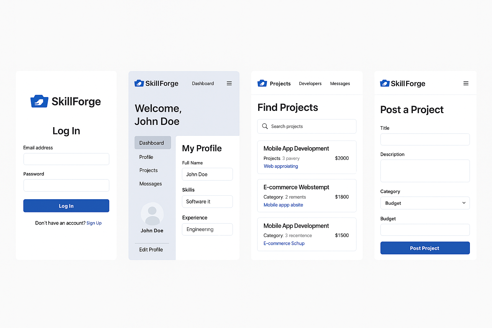

# SkillForge: Full-Stack Project Plan (NestJS + ReactJS)

## 🌟 Project Overview
**SkillForge** is a developer-focused freelance marketplace platform. Developers can create profiles, bid on projects, and showcase skills. Clients post projects and select candidates. Admins oversee platform health.

---

## 📊 Core Technologies

- **Frontend:** ReactJS, React Router, Axios, css
- **Backend:** NestJS, TypeORM, PostgreSQL, Multer
- **Optional Enhancements:** WebSockets (chat), Stripe API (mock), CI/CD, Docker

---

## 🔒 User Roles

- **Developer**: Profile, skills, proposal submission
- **Client**: Project creation, bid management
- **Admin**: Dashboard, user/project control

---

## 🔹 Weekly Plan

### Week 1: ReactJS Fundamentals
- Setup React with Vite/CRA
- Create base layout: Header, Footer, Home
- Dummy pages: Login, Register, Project Listings

### Week 2: ReactJS Advanced Concepts
- useContext, useEffect, React Router
- Forms with validation
- Auth context and protected routes

### Week 3: NestJS Fundamentals
- Setup NestJS project with modules/services
- Create Auth and User modules
- JWT-based login/register APIs

### Week 4: NestJS Advanced + DB Integration
- Setup PostgreSQL + TypeORM
- Entities: User, Developer, Client, Project, Proposal
- Role Guards, File Upload (Multer)

### Week 5: API Integration
- Connect React to Nest APIs (Axios)
- Auth flow: store token, protected routes
- Developer: Create/edit profile, view projects
- Client: Post/edit project, view bids

### Week 6: Polishing + Bonus Features
- Search, filter, pagination
- File upload (CV/Profile Image)
- Admin dashboard (basic charts/stats)
- Optional: Real-time chat (WebSockets)

### Week 7: Deployment
- Dockerize backend and frontend
- Use Vercel (frontend) & Render/Railway (backend)
- Environment config

---

## 🔗 Database Schema (Simplified)

- **User** (id, name, email, password, role)
- **DeveloperProfile** (bio, skills, github, userId)
- **ClientProfile** (companyName, description, userId)
- **Project** (title, description, budget, clientId)
- **Proposal** (projectId, developerId, message, status)

---

## 🔧 UI Components

- **Navbar** (conditional items: login/logout/dashboard)
- **CardProject** (title, budget, skills)
- **FormProposal** (textarea + submit)
- **ProfilePage** (developer & client variants)
- **AdminDashboard** (stats, tables, action buttons)

---

## 🌟 Bonus Enhancements

- Chat between clients and developers (WebSocket)
- Email notifications
- OAuth with Google/GitHub
- Ratings & reviews
- Payment mock (Stripe test mode)

---

## 🚀 Final Output
- Fully functioning web app
- Mobile-responsive UI
- Live deployment (frontend + backend)
- GitHub repository with README, environment docs
